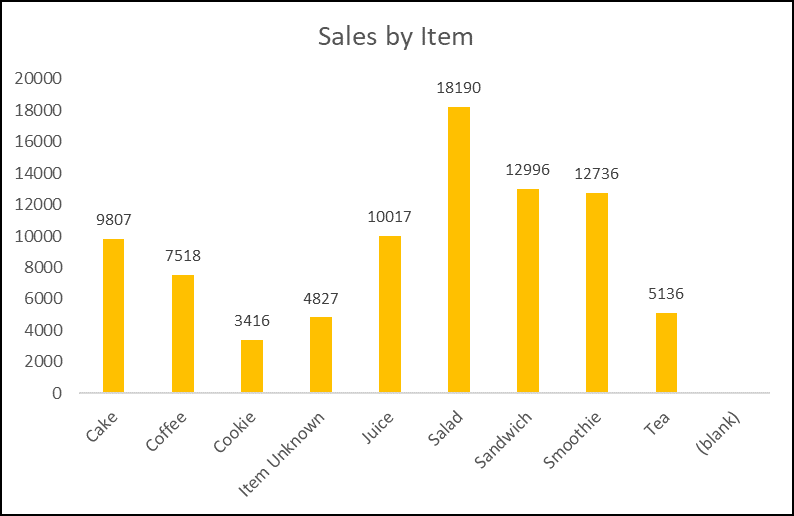
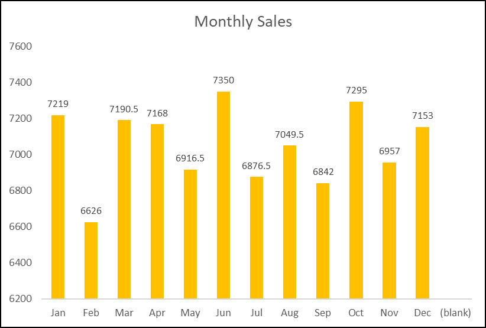
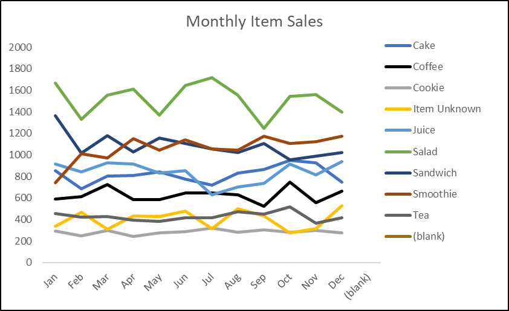

# ☕ Cafe Sales Data Analysis

## 📌 Project Overview
This project analyzes **customer spending patterns and sales behavior** for a cafe using transaction-level data.  
The aim is to uncover trends in product popularity, revenue contribution, and seasonal or weekly demand fluctuations.

---

## 📂 Dataset
- **Source:** [Kaggle](https://www.kaggle.com/datasets/ahmedmohamed2003/cafe-sales-dirty-data-for-cleaning-training)
- **Description:** Contains daily sales transactions with details such as product name, category, quantity sold, date, and price.

---

## 🛠 Tools & Technologies
- **Python** (Pandas) → Data cleaning & preprocessing  
- **SQL** → Query-based analysis for deeper insights  
- **Excel** → Pivot tables & chart visualization

---

## 🔄 Project Workflow
1. **Data Cleaning (Python)**  
   - Removed null values and duplicates  
   - Formatted date fields and standardized unknown/error/null values  

2. **Exploratory Data Analysis (SQL)**  
   - Identified top products by revenue  
   - Analyzed sales trends by day of week and month  

3. **Visualization (Excel)**  
   - Created pivot tables for product category performance  
   - Designed charts to highlight sales trends and top contributors

---

## 📊 Key Insights + Solutions
- 🥗 **Salads** contributed **20%** of total revenue — highest among all products.  
- 🍵 + 🍪 **Tea & Cookie combo** contributed **10%** combined.
  
- 📉 **Wednesday** had the lowest sales volume.
  **Solution:** Introduce mid-week promotions, such as *Buy One Get One Free* offers, *discounts* on certain items, or giving *free* items above a certain amount spent.
- ❄️ **February** recorded the lowest sales among all months.
  **Solution:** Organize events during *Valentine's week* such as live band music, *games for couples* to get discounts, or *blind dating*.

---

## 📈 Sample Visuals

  

---

